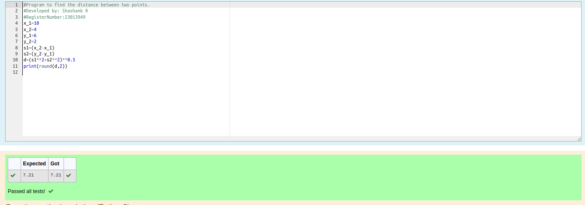

# DISTANCE-BETWEEN-TWO-POINTS

## AIM:
To write a python program to find the distance two 2 points
## ALGORITHM:
### Step 1: 
start the program  
### Step 2: 
Assign values for the variables 
### Step 3: 
Substitute the values in the distance formula  
### Step 4: 
print distance

### Step 5:
program to find the distance two 2 points 
### PROGRAM:
  
program to find the distance two 2 points was successfully executed.

### OUTPUT:!

### RESULT:
